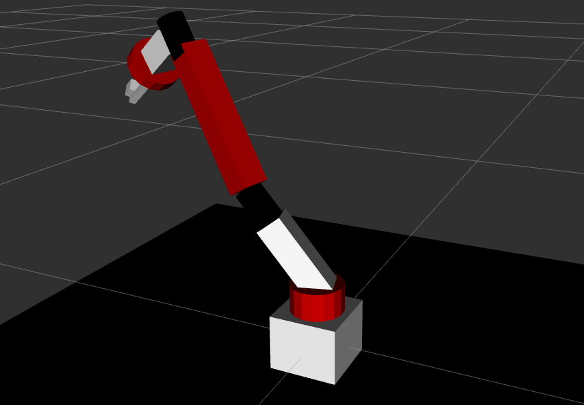

# Giới thiệu
Mô hình cánh tay robot 7 bậc tự do

Thông số kỹ thuật:
| Tham số        | Giá trị     |
| :------------- | :---------- |
| Số bậc tự      | 7           |
| Chiều dài (cm) | 50          |
| Số  link       | 12          |
| Số  join       | 11          |
# View robot trong RViz
```
$ source devel/setup.bash
$ roslaunch dof7_arm_model view_dof7_arm.launch
```
# MÔ PHỎNG ROBOT TRÊN GAZEBO
```
$ roslaunch dof7_arm_model dof7_arm_gazebo_control.launch
$ rostopipub -1 /dof7_arm_model/joint4_position_controller/command  std_msgs/Float64 2.0
```
